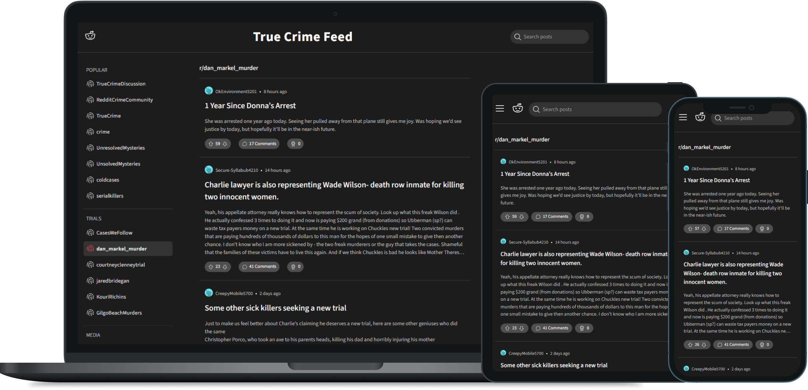

# True Crime Feed

A client-side web application focused on browsing and exploring true crime-related content from Reddit. This app uses the Reddit JSON API to fetch and display posts from popular true-crime subreddits, along with search functionality that allows users to explore additional subreddits and posts.

Built with React, Redux, and a responsive layout, this app provides an intuitive and immersive experience for true-crime enthusiasts.This project is part of Codecademy's Front-End Engineer path.

Check out the [Live Site](https://truecrimefeed.netlify.app/)



## Table of Contents

- [Features](#features)
- [Technologies Used](#technologies-used)
- [Installation](#installation)
- [Usage](#usage)
- [Future Improvements](#future-improvements)
- [Attribution](#attribution)
- [License](#license)

## Features

- **Browse True Crime Content**: View posts from popular true-crime-related subreddits, such as UnsolvedMysteries, ColdCases, and ForensicFiles.

- **Search Functionality**: Search across Reddit to find specific subreddits, posts, or keywords within the true-crime genre.

- **Post Detail View**: Click on any post to view its full content, comments, and discussion details.

- **Responsive Layout**: Optimized for desktop, tablet, and mobile devices, with a grid layout that adapts seamlessly to different screen sizes.

- **Subreddit Categories**: Subreddits are organized by categories like UNSOLVED and MEDIA for easy navigation.

- **Live Updates**: The app fetches the latest data from Reddit, so content is always up-to-date.

## Technologies Used

- **React**: Frontend JavaScript library for building user interfaces.
- **Redux**: State management to handle global application state.
- **Reddit JSON API**: To fetch posts, comments, and subreddit data.
- **React Router**: For handling navigation within the app.
- **CSS Grid**: For a responsive, grid-based layout.
- **Moment.js**: For formatting timestamps in post previews.

## Installation

1. Clone the repository:
   ```
   git clone https://github.com/chloeharris1/reddit-clone.git
   cd reddit-clone
   ```
2. Install dependencies:
   ```
   npm install
   ```
3. Start the development server:
   ```
   npm start
   ```
4. Open the app:
   Open http://localhost:3000 in your browser.

## Usage

- **Explore Posts**: Browse posts and discussions from selected true-crime subreddits.

- **Search**: Use the search bar to find specific true-crime content across Reddit.

- **View Full Post**: Click on a post to see details and comments.

- **Responsive Layout**: Enjoy a user-friendly experience on both desktop and mobile devices.

## Future Improvements

**Enhanced filters**: Add filtering options by date and popularity.

## Attribution

Icons from [Phosphor Icons](https://phosphoricons.com/)

## License

This project is licensed under the MIT License.
